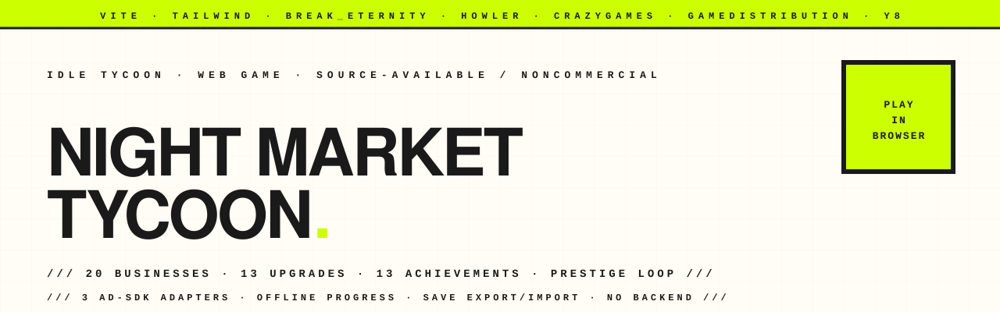
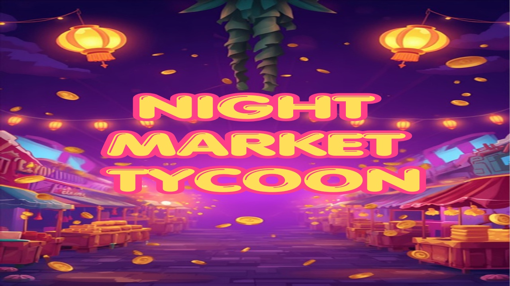

<p align="center">
  <picture>
    <source media="(prefers-color-scheme: dark)" srcset="assets-readme/hero-banner-dark.svg" />
    
  </picture>
</p>

<p align="center">
  <a href="https://hatimhtm.github.io/night-market-tycoon/"></a>
  <a href="https://github.com/hatimhtm/night-market-tycoon/actions/workflows/ci.yml"></a>
  
  
  
  <a href="LICENSE"></a>
</p>

<p align="center">
  <a href="https://hatimhtm.github.io/night-market-tycoon/">
    
  </a>
</p>

<p align="center">
  <em>An idle / tycoon browser game with 20 businesses, 13 upgrades, 13 achievements, a prestige loop, and a 3-platform ad-SDK abstraction. ~2,000 LOC of vanilla JS on Vite — no framework, single-file production bundle, runs offline once loaded. Built for CrazyGames / GameDistribution / Y8 / Poki distribution. Source-available under PolyForm Noncommercial.</em>
</p>

---

### `/// THE LOOP`

```
       click an icon
            │
            ▼                                  hire a manager
   ┌──────────────────┐                              │
   │  progress bar    │  ◀────────────────────────────┘   buy more of
   │  fills, cash $   │                                   the business
   │  drops in        │  ─────────────────▶  buy upgrades, hit milestones,
   └──────────────────┘                       speed bars by 2×
            │
            ▼
   accumulate $1T total  ──▶  prestige  ──▶  Reputation Stars
                                              (+2% profit / star, permanent)
            │
            ▼
   unlock more businesses, achievements,
   each achievement adds +1-5% profit forever
```

Standard idle-game DNA but tuned: **20 businesses** spanning vending machines to bazaar empires, **5 milestones per business** (25/50/100/250/500 owned → speed doublings), **13 upgrades** including the apex `VIP Lounge` (×10 global profit), **13 achievements** that each grant permanent stacking bonuses, **prestige loop** at $1T total earned, and **offline progress** for up to 7 days at 75% efficiency so leaving the tab open isn't the optimal strategy.

---

### `/// WHAT'S IN THE BOX`

| | |
|---|---|
| **`break_eternity.js`** for the math | All money is Decimal. Numbers go to ~`1e1000` cleanly, with a custom `fmt()` that switches to K/M/B/T/Qa/Qi notation. |
| **3 ad SDKs, one abstraction** | `src/ad-sdk.js` — flip a single constant (`AD_PLATFORM = 'crazygames'` / `'gamedistribution'` / `'stub'`) and the same code targets CrazyGames, GameDistribution, or Y8 (stub for portals that handle ads themselves). |
| **Rewarded-ad reward = 2h of current MPS** | Industry standard. Cooldown 3 min between watches. |
| **Howler.js audio** with 50 ms rate-limit per channel | Clicks/hovers don't machine-gun. Mute persists across sessions. |
| **Save export/import** | Settings → "Copy save to clipboard". Move between browsers / back up a run. |
| **Tamper-resistant saves** | Base64 + simple hash so save edits via DevTools fail the integrity check on load. |
| **Achievement toasts** | Slide-in toast notifications when a new achievement unlocks. |
| **Keyboard shortcuts** | `1`–`6` switch tabs, `M` mute, `P` prestige, `Esc` close any modal. |
| **Mobile-friendly** | Single-column layout below 700px, larger touch targets, smaller toasts. |
| **Single-file build** option | `vite-plugin-singlefile` available for portals that require one HTML upload. |

---

### `/// PROJECT LAYOUT`

```
night-market-tycoon/
├── index.html                          shell — left panel, tab bar, modals
├── style.css                           ~2k lines of game CSS, fully themed
├── package.json                        vite + tailwind 4 + break_eternity + howler
├── vite.config.js                      arm64/x86-friendly, single chunk output
├── src/
│   ├── main.js                         init · game loop · tab renderers · shortcuts
│   ├── state.js                        money, prestige, achievements, save export/import
│   ├── businesses.js                   20 business defs · cost / profit / time math
│   ├── managers.js                     auto-runner per business
│   ├── upgrades.js                     13 upgrades (some with prerequisites)
│   ├── achievements.js                 13 achievements + bonus calc
│   ├── audio.js                        howler wrapper with rate limiting
│   └── ad-sdk.js                       3-platform ad SDK abstraction
├── assets/
│   ├── images/                         business icons (32 PNGs, mostly Freepik)
│   ├── audio/                          ogg sounds (click / buy / unlock / etc.)
│   ├── particles/                      spark + star particle PNGs
│   └── ranks/                          rank001..003 (Apprentice → Tycoon)
├── portal-assets/                      submission images at portal specs
│                                       (1280×550, 1280×720, 1920×1080, 200×120, …)
└── assets-readme/                      brutalist banner SVGs (light + dark)
```

---

### `/// 2.0 — THE OVERHAUL`

The 1.0 build (15 businesses, 7 upgrades, no achievements, no stats) shipped to portals. 2.0 is a substantial expansion, not a polish pass:

**Content:**
- **20 businesses** (was 15) — late-game tier from Pop-up Stall to Bazaar Empire.
- **13 upgrades** (was 7) — new tier includes Neon Signage, Rush Hour, Night Lights, Chain Synergy, Sanitation II (prereq: Sanitation), VIP Lounge.
- **13 achievements** (new system) — each grants a permanent additive bonus (+1–5%) stacked on top of prestige stars.

**Systems:**
- **Stats tracking** — total clicks, total play time across sessions, biggest cash, biggest MPS, prestige count, first played, businesses/managers/upgrades bought.
- **Save export/import** — copy a Base64 string to clipboard, paste into another browser.
- **Toast notification system** — slide-in notices for achievements and save events.
- **Keyboard shortcuts** — `1`–`6` tabs, `M` mute, `P` prestige, `Esc` modal close.
- **Achievement check loop** — runs once per second; cheap, defensive (a bad getter doesn't take the game down).
- **Rank titles** — Apprentice / Vendor / Vendor II / Vendor III / Tycoon / Tycoon II / Mogul / Mogul Prime — three rank images mapped to eight title tiers.
- **Stacked cost discounts** — Sanitation II is gated behind Sanitation; cost-scaling drops 1.15 → 1.10 → 1.08.
- **Offline progress capped at 75%** — playing actively now always feels better than idling.

**UX:**
- Three new tabs in the right panel: **Achievements · Stats · Settings**.
- "Max" multiplier no longer says "Buy " when you can't afford one — shows "Need $X" instead.
- Achievement unlocks play the unlock SFX and pop a toast.
- Settings tab has copy-save-to-clipboard + import-from-clipboard buttons.

---

### `/// LOCAL DEV`

```bash
npm install
npm run dev       # vite dev server on :5173
npm run build     # production bundle to dist/
npm run preview   # serve dist/ on :4173 to smoke-test the build
```

Requires Node 20+. The build uses relative paths (`base: './'`) so the same `dist/` works on GitHub Pages, itch.io, CrazyGames, or any subdirectory deploy. Every push to `main` redeploys [the live demo](https://hatimhtm.github.io/night-market-tycoon/) via the CI workflow.

---

### `/// AD-SDK INTEGRATION`

`src/ad-sdk.js` exports `initAds()` and `showRewardedAd()`. Switch platforms by changing one constant:

```js
export const AD_PLATFORM = 'crazygames'; // 'gamedistribution' | 'crazygames' | 'stub'
```

For GameDistribution builds, include the SDK script in `index.html` and pass `gameId` to `initAds()`. For CrazyGames, the SDK is loaded lazily by the abstraction. The `stub` mode is used for Y8 (which handles its own ads) and for local development — `showRewardedAd()` always resolves true after a brief pause.

---

### `/// LICENSE`

[PolyForm Noncommercial 1.0.0](LICENSE). In plain English:

- ✅ Read it, study it, fork it for personal/non-profit use, share it among friends, learn from the math.
- ❌ Don't repackage and sell it. Don't embed it in a paid product. Don't ship it under a different name on a portal monetised against the original work.

If you want commercial terms, [open an issue](../../issues) or [book a call](https://cal.com/hatimelhassak/engineering-discovery).

---

<p align="center">
  <a href="https://hatimelhassak.is-a.dev"></a>
  <a href="https://cal.com/hatimelhassak/engineering-discovery"></a>
  <a href="https://www.linkedin.com/in/hatim-elhassak/"></a>
  <a href="mailto:hatimelhassak.official@gmail.com"></a>
</p>

<p align="center">
  <code>///&nbsp;&nbsp;OPEN FOR NEW WORK&nbsp;&nbsp;///&nbsp;&nbsp;CONTRACT &amp; FREELANCE&nbsp;&nbsp;///&nbsp;&nbsp;REMOTE WORLDWIDE&nbsp;&nbsp;///</code>
</p>
